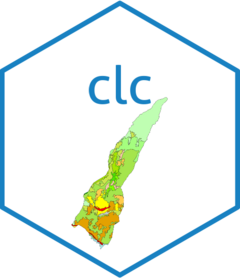

<!-- README.md is generated from README.Rmd. Please edit that file -->

```{r, include = FALSE}
knitr::opts_chunk$set(
  collapse = TRUE,
  comment = "#>",
  fig.path = "man/figures/README-",
  out.width = "100%"
)
```

# clc 

<!-- badges: start -->
<!-- [](https://CRAN.R-project.org/package=clc) -->
[](https://github.com/josesamos/clc/actions/workflows/R-CMD-check.yaml)
[](https://app.codecov.io/gh/josesamos/clc)
<!-- badges: end -->

*CORINE Land Cover* (*CLC*) is a European land use and land cover classification system that provides standardized geospatial data on land cover categories. It includes an associated style definition, typically stored in formats like GeoPackage, which links land cover codes to descriptive labels and visualization attributes (e.g., colors) for consistent representation across GIS platforms.

The `clc` package simplifies workflows for common tasks, such as reading a CLC vector file, visualizing it with its style, clipping the data to a region, saving the output with its style, and converting it to raster format, supporting CLC data in both GeoPackage and PostGIS as sources and destinations.

## Installation

You can install the released version of `clc` from [CRAN](https://CRAN.R-project.org) with:

``` r
install.packages("clc")
```

And the development version from [GitHub](https://github.com/) with:

``` r
# install.packages("pak")
pak::pak("josesamos/clc")
```

## Example

This is a basic example which shows you how to solve a common problem.

Read the CLC data from the GeoPackage and visualize the CLC data with styles.

```{r example-1, fig.width=10, fig.height=7, dpi=300, out.width="100%", fig.align='center', fig.alt="CLC example 1, original"}
library(clc)

source_gpkg <- system.file("extdata", "clc.gpkg", package = "clc")

clc_data <- clc(source = source_gpkg, layer_name = "clc")

clc_data |> 
  plot_clc()
```


Read the clipping layer (region of interest), clip the CLC data to the region of interest and visualize the clipped CLC data with styles.


```{r example-2, fig.width=10, fig.height=7, dpi=300, out.width="100%", fig.align='center', fig.alt="CLC example 2, clipped"}
region <- sf::st_read(source_gpkg, layer = "lanjaron", quiet = TRUE)

clc_clipped <- clc_data |> 
  cut_to_extent(region)

clc_clipped |> 
  plot_clc()
```

Convert the clipped CLC data to raster format and visualize it with styles.

```{r example-3, fig.width=10, fig.height=7, dpi=300, out.width="100%", fig.align='center', fig.alt="CLC example 3, raster"}
raster_path <- system.file("extdata", "mdt.tif", package = "clc")

base_raster <- terra::rast(raster_path)

clc_raster <- clc_clipped |> 
  as_raster(base_raster = base_raster)

clc_raster |> 
  plot_clc()
```

Save the clipped data and its styles to a new GeoPackage.

```{r example-4}
output_gpkg <- tempfile(fileext = ".gpkg")

sink(tempfile())

clc_clipped |> 
  save_to(output_gpkg)

sink()
```

Get a raster in `terra::SpatRaster` format to store it in a file, for example.

```{r example-5}
clc_r <- clc_raster |>
  get_raster()

output_tif <- tempfile(fileext = ".tif")

terra::writeRaster(clc_r,
                   output_tif,
                   filetype = "GTiff",
                   overwrite = TRUE)
```
