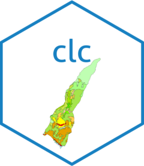

<!-- README.md is generated from README.Rmd. Please edit that file -->

# clc 

<!-- badges: start -->
<!-- badges: end -->

*CORINE Land Cover* (*CLC*) is a European land use and land cover
classification system that provides standardized geospatial data on land
cover categories. It includes an associated style definition, typically
stored in formats like GeoPackage, which links land cover codes to
descriptive labels and visualization attributes (e.g., colors) for
consistent representation across GIS platforms.

The goal of `clc` is to support operations with CORINE Land Cover data,
addressing the challenges and specificities it presents, particularly
those related to its associated styles.

## Installation

You can install the development version of clc from
[GitHub](https://github.com/) with:

``` r
# install.packages("pak")
pak::pak("josesamos/clc")
```

## Example

This is a basic example which shows you how to solve a common problem:

``` r
library(clc)
## basic example code
```

What is special about using `README.Rmd` instead of just `README.md`?
You can include R chunks like so:

``` r
summary(cars)
#>      speed           dist       
#>  Min.   : 4.0   Min.   :  2.00  
#>  1st Qu.:12.0   1st Qu.: 26.00  
#>  Median :15.0   Median : 36.00  
#>  Mean   :15.4   Mean   : 42.98  
#>  3rd Qu.:19.0   3rd Qu.: 56.00  
#>  Max.   :25.0   Max.   :120.00
```

You’ll still need to render `README.Rmd` regularly, to keep `README.md`
up-to-date. `devtools::build_readme()` is handy for this.

You can also embed plots, for example:

In that case, don’t forget to commit and push the resulting figure
files, so they display on GitHub and CRAN.
